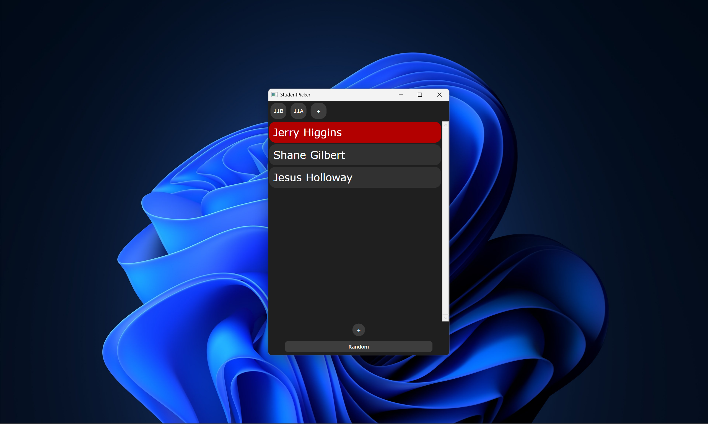
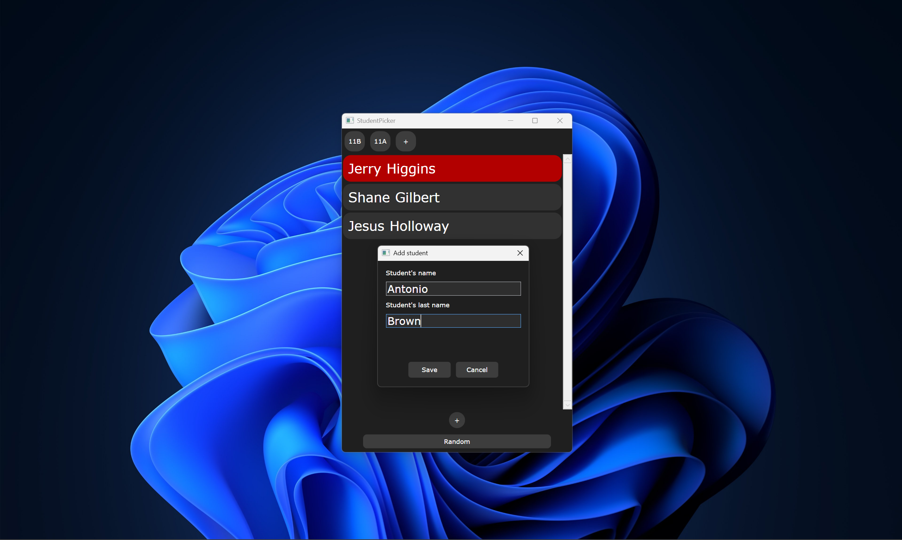
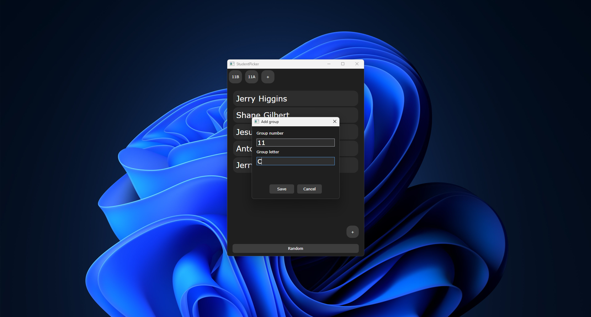

# StudentPicker
A simple WPF application designed to make the process of choosing a student for answer more objective. 
If your students think that you are biased against them, then you should use this application.

## Application Features
### Students
- Add students
- Edit student information
- Remove students
- Random student selection

### Groups
- Create groups
- Edit groups
- Add students to groups
- Random selection within a group

## Exemples
 

***  

## Technology Stack
- **Language:** C# (.NET 9.0) 
- **Framework:** WPF 
- **Architecture:** MVVM (Model-View-ViewModel)  
- **UI:** XAML  
- **Version Control:** Git & GitHub

## Libraries
- **CommunityToolkit.Mvvm** — v8.2.0  
  Provides helpers for MVVM implementation, commands, and property notifications.  
- **Microsoft.Extensions.Dependency** - v10.0.0  
  For dependency injection in the application.  
- **Microsoft.Extensions.Hosting - v10.0.0**  
  For managing application startup and lifecycle.

## Version 
 **🚧Beta-version🚧** 
 
_The project is under active **development**._
_This is the first public release._
